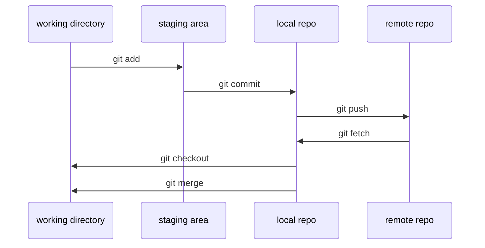

# 개념
- 깃은 컴퓨터 파일의 변경사항을 추적하고 여러 명의 사용자들 간에 해당 파일들의 작업을 조율하기 위한 분산 버전 관리 시스템이다. 소프트웨어 개발에서 소스 코드 관리에 주로 사용되지만 어떠한 집합의 파일의 변경사항을 지속적으로 추적하기 위해 사용될 수 있다. 기하학적 불변 이론을 바탕으로 설계됐고, 분산 버전 관리 시스템으로서 빠른 수행 속도에 중점을 두고 있는 것이 특징이며 데이터 무결성,분산, 비선형 워크플로를 지원한다.

# 기본
## git 프로세스

출처: http://pismute.github.io/whygitisbetter/#
# 시작

`git init`
- git 저장소 만들 때 사용 : git 저장소 directory 에서 `git init` 한다.

`git fetch`
- 원격 저장소의 데이터를 로컬에 **가져오기**만 하기 (로컬 repo에 write 되지는 않고, 원격 repo를 read 할수 있다?)

`git clone`
- 
`git checkout`
`git checkout -b []`
`git add`
`git commit`
- `git commit -a`
`git push`
`git checkout`
`git merge`

# 심화
`git log`
- `git log -p`
- `git log -L`
`git remove`
`git status`
`git diff`
`git tag`
`git reset`
`git reflog`
`git clean`

브런치 생성
브런치 이동
원격 브런치 가져오기
원격 브런치에 밀어 넣기
pull request
git flow

git log

workflow
